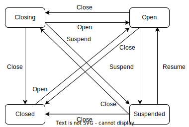

## Motivation

<!--

Volcano的队列提供了一系列资源管理能力，用户可以开启、关闭队列来进行队列生命周期的管理，目前包含了Open、Closing、Closed三种状态，详细的设计请参考[queue state management](https://github.com/volcano-sh/volcano/blob/master/docs/design/queue/queue-state-management.md)，当用户执行关闭队列的动作时，通常表示用户想结束队列的生命周期，等到队列内的所有作业都运行完成后，队列最终进入Closed状态，然后用户可以安全地对队列做一些操作，比如删除队列，并且在队列结束过程中和结束之后，队列都不能提交新的作业，这是一种比较严格的约束，并且主要用在用户想删除队列的场景中。

但是在实际生产环境中，有些时候用户只是想对队列的一些属性进行修改，比如队列配额、抢占策略、权重等等，并不是要删除队列，用户希望在更改队列属性的过程中可以暂停队列的调度功能，以便安全地进行队列属性的更改，避免一些非预期的行为发生，并且在暂停调度的过程中队列还可以正常提交作业，只是不会为这些作业分配资源，而不是像关闭队列那样阻止作业的调度，暂停队列的调度是一种相对于关闭队列来讲较为宽松的动作。

-->

Volcano's queues offer a range of resource management capabilities. Users can open or close queues to manage their lifecycle, which currently includes three states: Open, Closing, and Closed. For detailed design, please refer to [queue state management](https://github.com/volcano-sh/volcano/blob/master/docs/design/queue/queue-state-management.md). When a user performs the action of closing a queue, it usually indicates that the user wants to end the life cycle of the queue. Once all jobs within the queue have completed execution, the queue will transition to the Closed state. At this point, users can safely perform operations on the queue, such as deleting it. Additionally, during the queue's termination process and afterward, no new jobs can be submitted to the queue. This is a stringent constraint primarily used in scenarios where users intend to delete the queue.

However, in real-world production environments, there are instances where users merely wish to modify certain attributes of the queue, such as its quota, preemption policy, or weight, rather than deleting the queue. In such cases, users desire to temporarily suspend the queue's scheduling function to safely make these attribute changes, thereby preventing any unintended behaviors. During this suspension period, jobs can still be submitted to the queue, but no resources will be allocated to them. This approach is less restrictive than closing the queue, which prevents job scheduling altogether. Suspending queue scheduling is a more lenient action compared to closing the queue.

## In scope

<!--

提供一种新的队列暂停调度能力，允许用户在队列暂停调度过程中修改队列的属性，进行一些运维操作，并且允许队列提交新的作业，但不进行资源分配，待修改完毕后恢复队列的调度，用户新提交的作业可以进行调度。

-->

Support a new capability to suspend queue scheduling, allowing users to modify queue attributes and perform maintenance operations when queue is suspended. New jobs can still be submitted to the queue, but no resources will be allocated. Once the modifications are complete, scheduling for the queue can be resumed, and the new submitted jobs can then be scheduled.

## Proposal

<!--

目前队列有Open，Closing，Closed，Unknown几种状态，需要为队列新增一个Suspended暂停状态，在该状态下，用户可以提交作业到队列，但不会为作业分配资源，待队列运维完成后，队列可以由Suspended状态转换为Open状态。

用户通过vcctl可以暂停/取消暂停队列的调度，或者通过创建bus command指定Suspend/Resume action来暂停/恢复队列的调度。

-->

Currently the queue has several states Open, Closing, Closed, Unknown, we need to add a `Suspended` state for the queue, in this state, the user can submit jobs to the queue, but will not allocate resources for the job, once the queue maintenance is completed, the queue can change to the `Open` state  from `Suspended` state .

Users can pause/resume the scheduling of the suspended queue through `vcctl`, or specify `Suspend`/`Resume` action to pause/resume the scheduling of the queue by creating a `bus command`.

## User Stories

### Story 1

<!--

作为一个集群管理员，我需要根据集群资源动态调整队列的配额、权重和优先级等关键属性。鉴于这些操作的敏感性，它们可能影响当前作业的调度优先级和结果。因此，在执行队列运维时，我希望可以暂停队列资源的分配，以便创建一个安全的变更窗口。在此期间，我可以安全地修改队列属性，确保所有正在提交的作业调度结果不受干扰，从而有效规避任何非预期的调度结果。

-->

As a cluster administrator, I need to dynamically adjust key attributes such as quotas, weights, and priorities of queues based on cluster resources. Given the sensitive nature of these operations, they may affect the scheduling priority and outcome of the current job. Therefore, when performing queue operations, I would like to be able to pause the allocation of queue resources to create a safe window for changes. During this period, I can safely modify the queue properties to ensure that the scheduling results of all jobs being submitted are not disturbed, thus effectively avoiding any unexpected scheduling results. 

### Story 2

<!--

作为一个用户，我希望集群管理员在对队列进行运维操作时，我可以继续进行作业的提交，不应该对提交作业进行限制。

-->

As a user, I hope that when the cluster administrator performs operation and maintenance operations to the queue, I can continue to submit jobs, and there should be no restrictions on job submissions.

### Story 3

<!--

作为一个集群管理员，在对队列的运维操作结束后，我希望可以恢复队列的调度，在队列运维过程中提交的作业运行可以恢复调度，新提交的作业也可以调度。

-->

As a cluster administrator, after the operation and maintenance of the queue is completed, I hope that the scheduling of the queue can be restored. The jobs submitted during the queue operation and maintenance can be resumed and the newly submitted jobs can also be scheduled.

## Implementation

<!--

我们需要修改volcano的以下几个部分来支持队列的暂停/恢复调度能力。

-->

We need to modify the following parts of volcano to support the queue's pause/resume scheduling capabilities.

### API Change

<!--

在pkg/apis/scheduling/v1beta1/types.go文件中为队列增加一个新的状态`Suspend`，表示队列处于暂停中。

在pkg/apis/bus/v1alpha1/actions.go文件中新增两个action，SuspendQueue和ResumeQueue，分别表示暂停队列和恢复队列调度的动作。

-->

Add a new status `Suspend` to the queue in the `pkg/apis/scheduling/v1beta1/types.go`, indicating that the queue is suspended.

```go
// QueueStateOpen indicate `Open` state of queue
QueueStateOpen QueueState = "Open"
// QueueStateClosed indicate `Closed` state of queue
QueueStateClosed QueueState = "Closed"
// QueueStateClosing indicate `Closing` state of queue
QueueStateClosing QueueState = "Closing"
// QueueStateUnknown indicate `Unknown` state of queue
QueueStateUnknown QueueState = "Unknown"
// QueueStateSuspended indicate `Suspended` state of queue
QueueStateSuspended QueueState = "Suspended" # New added
```

Add two new actions in the `pkg/apis/bus/v1alpha1/actions.go`, `Suspend` and `Resume`, which represent the actions of suspending the queue and resuming queue scheduling respectively.

```go
// OpenQueueAction is the action to open queue
OpenQueueAction Action = "OpenQueue"

// CloseQueueAction is the action to close queue
CloseQueueAction Action = "CloseQueue"

// SuspendQueueAction is the action to suspend queue
SuspendQueueAction Action = "SuspendQueue"

// ResumeQueueAction is the action to resume queue
ResumeQueueAction Action = "ResumeQueue"
```


### Volcano components

#### Volcano controller

<!--

在pkg/controllers/queue/state中新增suspended文件，处理Open，Resume，Close action，根据action类型分别更新队列到相应的状态。

队列在Open，Closing，Unknown状态下时，处理Suspend和Resume action。

- 当队列为Open，Closing或Unknown状态时，收到Suspend action，将队列更新为suspended状态，收到Resume action时，不做任何处理。

- 当队列为Closed状态时，和前几种状态有一些区别，收到Suspend和Resume action时，不做任何处理，因为处于Closed状态的队列表示队列的生命周期已经结束，若接收到Suspend action时更新队列为Suspended状态，则队列可以提交作业，与Closed状态下的作业提交行为不符，因此处于Closed状态时的队列只能由Open action来更改，这也符合Open和Close是一对操作的设计。

当层级队列功能实现后，见[PR](https://github.com/volcano-sh/volcano/pull/3743)，当用户暂停/恢复队列的调度时，同时需要对子队列执行相同的操作，将子队列更新为对应的状态。

-->

Add a suspended file in `pkg/controllers/queue/state` to handle `Open`, `Resume`, and `Close` actions, and update the queue to the corresponding state according to the action type.

When the queue is in the `Open`, `Closing`, or `Unknown` state, the Suspend and Resume actions are processed.

- When the queue is in the `Open`, `Closing` or `Unknown` state, and the `Suspend` action is received, the queue is updated to the `Suspended` state. When the `Resume` action is received, no processing is performed.

- When the queue is in the `Closed` state, there are some differences from the previous states. When the `Suspend` and `Resume` actions are received, no processing is performed, because the queue in the Closed state indicates that the life cycle of the queue has ended. If the `Suspend` action is received, When the queue is updated to the `Suspended` state, the queue can submit jobs, which is inconsistent with the job submission behavior in the `Closed` state. Therefore, the queue in the `Closed` state can only be changed by the `Open` action. This is also consistent with the design of `Open` and `Close` as a pair of operations.

When the hierarchical queue function is implemented, see [PR](https://github.com/volcano-sh/volcano/pull/3743), when the user suspend/resume the scheduling of the queue, the same operation needs to be performed on the sub-queues at the same time, and update the sub-queues to the corresponding state.

<div align="center"></div>

#### Volcano scheduler

<!--

修改allocate、backfill、preempt、reclaim，当队列暂停调度时，跳过当前队列的job，不进行调度。同时修改job.FitError逻辑，记录由于队列暂停导致job未调度成功的事件。

-->

Modify allocate, backfill, preempt, and reclaim. When the queue suspends scheduling, the job of the current queue will be skipped and will not be scheduled. At the same time, modify the `job.FitError` logic to record the event that the job was not scheduled successfully due to queue suspension.

#### Volcano admission

<!--

修改pkg/webhooks/admission/queues/validate/validate_queue.go中validateQueue的逻辑，允许用户创建Suspended状态的的队列。

修改pkg/webhooks/admission/jobs/validate/admit_job.go中validateJobCreate的逻辑，允许用户提交作业到处于Suspended状态的队列。

修改pkg/webhooks/admission/pods/validate/admit_pod.go中validatePod的逻辑，允许用户提交Pods到处于Suspended状态的队列。

-->

Modify the logic of `validateQueue` in `pkg/webhooks/admission/queues/validate/validate_queue.go` to allow users to create queues in the `Suspended` state.

Modify the logic of `validateJobCreate` in `pkg/webhooks/admission/jobs/validate/admit_job.go` to allow users to submit jobs to the queue in the `Suspended` state.

Modify the logic of `validatePod` in `pkg/webhooks/admission/pods/validate/admit_pod.go` to allow users to submit Pods to the queue in the `Suspended` state.