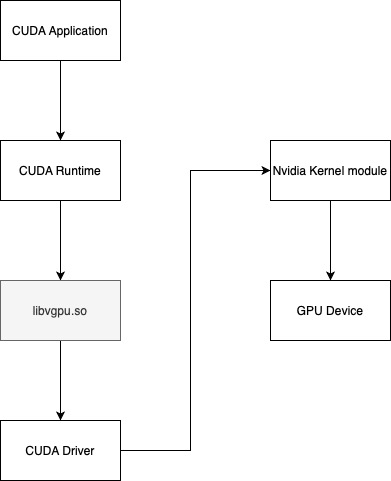

# design.md

## Introduction

volcano-vgpu is designed to provide volcano cluster the ability to 

***Virtualize GPU*** A task can allocate a vGPU device by specifying the device memory limit. volcano-vgpu will make sure that task senses the vGPU as a physical GPU with specified device memory.

***Share multiple GPUs*** A task can allocate multiple vGPUs. It can do so by setting both device number and device memory.

***Device memory control*** Volcano-vgpu will ensure proper isolation between vGPUs. The device memory usage of a vGPU will never excced the specified limit.

***Virtual Device Memory*** Users can choose to oversubscribe device memory in certain GPU. It allows device memory usage in that GPU exceed the device limit by using host memory as swap.

## Components

The component of volcano-vgpu contains several adjustments in volcano main repo, and a seperate vgpu-volcano-device-plugin reposiotry, as the image shown below:

Note that the orange components are which need to be modifyed, while others are new components to be added.

## Walkthrough of vgpu pods

If a pod with vGPU resouce is submitted, the flow of prcessing is shown in the following image:

The reason we need to modify nvidia-container-runtime is that is the only chance to set the NVIDIA_VISIBLE_DEVICES env. We can't set it in mutating webhook because the pods hasn't been scheduled yet, nor can we set it in device-plugin because we don't know which container request the vGPU resource.

nvidia-container-runtime communicates with scheduler cache by using gRpc. It sends the containerUUID set in admission webhook in order to identify the requesting container.

## How to maintain vgpu status

Scheduler cache get the overview of vGPU status by using informer.AddFunc, It collects vGPU related annotations on each pods. Restarting the scheduler won't cause any issue.

## Why do we need gRPC communication

Because current device-plugin allocate strategy won't work in certain scenarios:

Scenario1:

There are 2 pods(podA and podB) in pending state. Both of them have one container which require 2 vGPUs:podA requires vGPU0,vGPU1,podB requires vGPU2,vGPU3. You can't distinguish podA from podB in device_plugin.Allocate with current implementation, as a result ,you don't know which 2 of vGPUs to respond.

Scenario2:

There are 2 containers(ctrA,ctrB) in a pod. ctrA requires vGPU0,vGPU1. ctrB requires vGPU2,vGPU3, you can't distinguish ctrA from ctrB in device_plugin.Allocate with current implementation, as a result, you don't know which 2 of vGPUs to respond.

## Details of libvgpu.so

Libvgpu.so is a cuda driver hacked library. By adding it in LD_PRELOAD or "/etc/ld.so.preload", it can hack the invocation from CUDA Runtime to CUDA Driver as the image above. We track the device memory usage and utilization of each process in libvgpu.so and reject device memory allocation if it exceeds the number set in "gpumem" to ensure proper isolation. 

